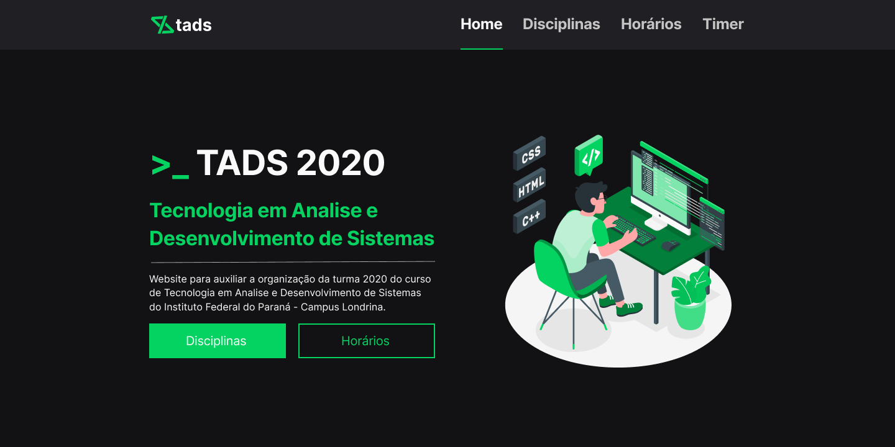

  

 

  

## 📓 Resumo

- [Sobre o projeto](#sobre-o-projeto)
- [Overview](#overview)
- [Design](#design)
- [Techs](#techs)
- [License](#license)
- [Contribuição](#contribuição)

## ❓ Sobre o projeto

Website para auxiliar os discentes do curso de Tecnologia em Analise e Desenvolvimento de Sistemas do IFPR campus Londrina - Turma 2020

## 🚀 Overview

 

  

## 🎨 Design

A modelagem do projeto foi feita utilizando a ferramenta Figma.\
Pode ser acessado através do link:\
https://www.figma.com/file/2fjpFnIXBC7CnIyFxuQSyA/tads-website?node-id=0%3A1

## 🛠️ Techs

<table>
  <tr>
    <td>
      
    </td>
  </tr>
  <tr>
    <td>
      
    </td>
  </tr>
</table>

## 🤟🏼 Contribuição

Quaisquer contribuições que você fizer serão muito bem recebida.

1. 🍴 Fork the Project
2. 👯 Clone this project (`git clone https://github.com/cristianprochnow/move-it.git`)
3. 🔀 Create your Feature Branch (`git checkout -b my-feature`)
4. ✔️ Commit your Changes (`git commit -m 'feat: My new feature'`)
5. 📌 Push to the Branch (`git push origin my-feature`)
6. 🔁 Open a Pull Request

## 📜 License

This project is under **MIT License**. Check `LICENSE` for more details.
